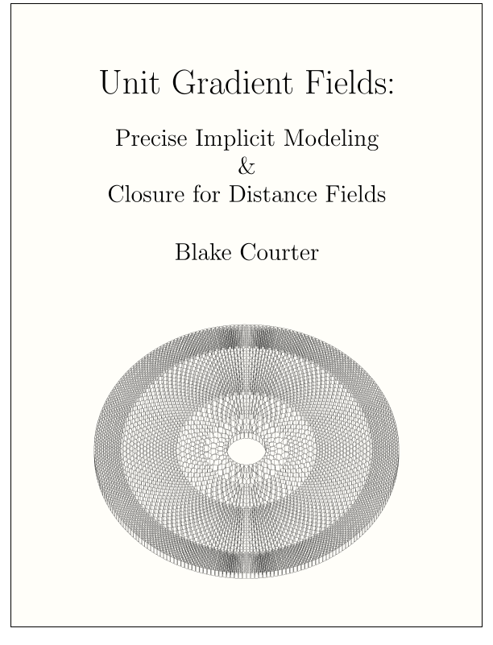
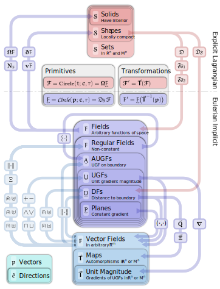

Unit gradient fields (UGFs), like signed distance fields SDFs, have gradients with unit magnitude.  Although they do not necessarily represent the Euclidean distance to a shape, they are closed under offsets and booleans, unlike SDFs.  This project explores the relationships between SDFs, and UGFs, and other fields.

I'm currently collecting my notes in a document that appears to be turning into a book.  It's at a very early stage where it could use feedback.  I look forward to your thoughts. 

### [Preview Manuscript&nbsp;&nbsp;&nbsp;  {: width="30%" height="30%" align=center}]( {{site.data.ugf.latest}} ){: onclick="gtag('event', 'download_ugf');" target="_blank"}

### [Subscribe to Updates](https://docs.google.com/forms/d/e/1FAIpQLSc7ODKkQD2kd8LXfOm2oLpm4oX-CWgO6g4Hz_fSaMZh3sm75Q/viewform?usp=sf_link){:target="_blank"}

### [Slide Presentation (WIP)](https://docs.google.com/presentation/d/1z2GceOWif3Mue2EMChB6nVxam9DzBOQ-i1lPOPXsKRo/){: onclick="gtag('event', 'ugf_presentation');" target="_blank"}

### [Follow on GitHub](https://github.com/bcourter/UGFs){:target="_blank"}

### [Comment on Overleaf](https://www.overleaf.com/read/fczzwxwhktsj){:target="_blank"}

## Overview:
Some of the main objects and operations relate as follows:

{: width="39%" height="39%"}
&nbsp;&nbsp;&nbsp;
{: width="57%" height="57%"}

